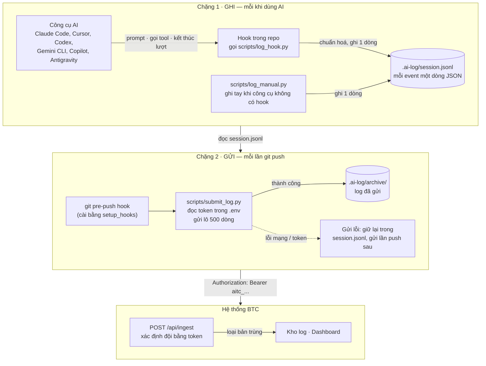
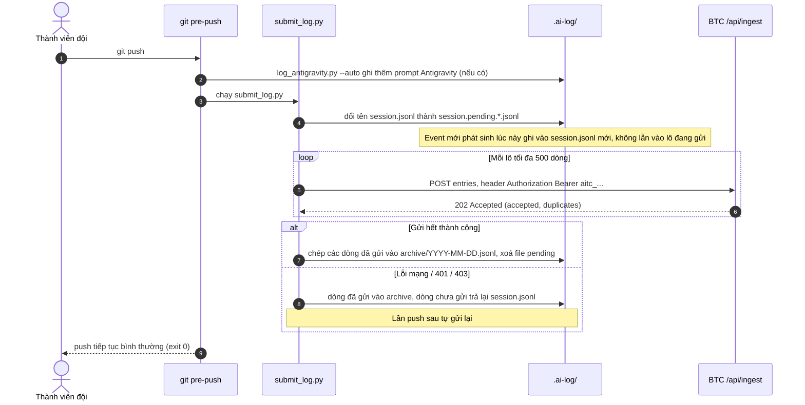

# Cấu hình AI Log

Ở vòng Chung khảo, mỗi đội phải **ghi lại quá trình làm việc với công cụ AI** (prompt, các lần AI gọi tool, kết quả, lỗi) và **gửi lên hệ thống của Ban Tổ Chức (BTC)**. BTC cung cấp sẵn bộ hook mẫu `ai-hook-template` cho Claude Code, Cursor, Codex, Gemini CLI, GitHub Copilot và Antigravity: cài một lần, sau đó log được ghi tự động và gửi đi mỗi lần `git push`.

:::warning[Lưu ý quan trọng]
**Các bạn có thể sửa script miễn sao đảm bảo push đủ, đúng những event BTC yêu cầu và không có hành vi can thiệp log.**

Xem chi tiết ở mục [Được sửa gì, không được làm gì](#duoc-sua-gi-khong-duoc-lam-gi).
:::

## 1. Luồng hoạt động

Log đi qua hai chặng: **ghi** (mỗi khi bạn dùng AI) và **gửi** (mỗi khi bạn `git push`).



Một số điểm cần nắm:

- Hook **chỉ ghi** khi repo có remote `origin`; không có `origin` thì event bị bỏ qua (không gắn được với đội nào).
- Token trong `.env` quyết định log thuộc đội nào. Trường `repo`, `student` trong log chỉ để đối chiếu, không dùng để xác định đội.
- `git push` **không bao giờ bị chặn** vì lỗi gửi log: log lỗi được giữ lại và gửi lại ở lần push sau.

### Chuyện gì xảy ra khi push



## 2. Cài đặt

**Yêu cầu:** `git`, **Python 3.10 trở lên** (`python --version`, trên Windows có thể dùng `py -3 --version`). Trên Windows cần **Git for Windows** (có Git Bash) vì hook chạy bằng bash.

### Bước 1 — Đưa bộ hook vào repo của đội

Chép toàn bộ nội dung repo mẫu `ai-hook-template` do BTC cung cấp vào **thư mục gốc** repo của đội (giữ nguyên các thư mục ẩn `.claude/`, `.cursor/`, `.codex/`, `.gemini/`, `.github/hooks/`, `.agents/`, `.ai-log/` và thư mục `scripts/`), rồi commit.

:::tip
Mở công cụ AI tại **thư mục gốc repo**. Các công cụ chỉ đọc file cấu hình hook trong workspace đang mở; mở thư mục con thì hook không chạy.
:::

### Bước 2 — Cài git pre-push hook

Mỗi thành viên chạy **một lần** trên máy mình sau khi clone (thư mục `.git/hooks/` không được commit nên không tự có):

```bash
# Linux / macOS / Git Bash
bash scripts/setup_hooks.sh
```

```powershell
# Windows PowerShell
powershell -ExecutionPolicy Bypass -File scripts\setup_hooks.ps1
```

Kết quả mong đợi: `[ai-log] Git pre-push hook installed.`

Cài thêm thư viện đọc `.env`:

```bash
python -m pip install python-dotenv
```

### Bước 3 — Điền token BTC cấp

```bash
cp .env.example .env        # Windows PowerShell: Copy-Item .env.example .env
```

Mở `.env` và dán token của đội (bắt đầu bằng `aitc_`, BTC gửi riêng cho từng đội):

```ini
AI_LOG_SERVER=https://live.thucchien.ai/api/ingest
AI_LOG_API_KEY=aitc_...token-cua-doi...
```

**Không commit `.env`** (đã có trong `.gitignore`) và không gửi token cho người ngoài đội.

### Bước 4 — Kiểm tra

1. Gõ một prompt bất kỳ trong công cụ AI, kiểm tra `.ai-log/session.jsonl` có thêm dòng mới.
2. Gửi thử ngay, không cần push:

```bash
python scripts/submit_log.py
```

| Thông báo | Ý nghĩa |
|---|---|
| `[ai-log] Submitted N entries → 202` | Thành công, N dòng đã lên hệ thống. |
| `[ai-log] No logs to submit.` | Chưa có dòng log nào. |
| `[ai-log] AI_LOG_SERVER not set — skipping submission.` | Chưa đọc được `.env` (thiếu `python-dotenv` hoặc `.env` không ở thư mục gốc). |
| `[ai-log] Submit failed: HTTP Error 401` | Token sai/thiếu. Kiểm tra `AI_LOG_API_KEY`. |
| `[ai-log] Submit failed: HTTP Error 403` | Bảng đấu của đội đã bị khoá, hệ thống không nhận log nữa. |

Claude Code, Cursor, Gemini CLI, Antigravity có thể hỏi có tin tưởng hook của workspace không: hãy **đồng ý**.

## 3. Event BTC yêu cầu {#event-btc-yeu-cau}

Đây là các event phải được ghi và gửi lên. Bộ hook mẫu đã đăng ký sẵn đúng các event này; nếu bạn sửa cấu hình hoặc script thì vẫn phải giữ đủ.

| Công cụ (`tool`) | Prompt người dùng | Mỗi lần AI gọi tool | Kết thúc lượt / phiên |
|---|---|---|---|
| Claude Code (`claude`) | `UserPromptSubmit` | `PostToolUse`, `PostToolUseFailure` | `Stop`, `SubagentStop`, `SessionStart` |
| Cursor (`cursor`) | `beforeSubmitPrompt` | `postToolUse`, `postToolUseFailure` | `afterAgentResponse`, `stop` |
| Codex (`codex`) | `UserPromptSubmit` | `PostToolUse` | `Stop` |
| Gemini CLI (`gemini`) | `BeforeAgent` | `AfterTool` | `AfterAgent`, `SessionEnd` |
| GitHub Copilot (`copilot`) | `userPromptSubmitted` | `postToolUse`, `postToolUseFailure` | `agentStop`, `sessionEnd` |
| Antigravity (`antigravity`) | `PreInvocation` (hook) và quét transcript khi push | — | — |
| Công cụ không có hook (ChatGPT web, Gemini web...) | ghi tay bằng `log_manual.py` | — | — |

Ghi tay cho công cụ không có hook:

```bash
bash scripts/_pyrun.sh scripts/log_manual.py --tool chatgpt --prompt "Mô tả việc đã hỏi"
```

### Định dạng một dòng log

Mỗi event là **một dòng JSON** trong `.ai-log/session.jsonl`. Ví dụ một lần AI chạy lệnh:

```json
{
  "ts": "2026-10-02T14:05:31.123+07:00",
  "tool": "claude",
  "event": "PostToolUse",
  "session_id": "4f1c...",
  "model": "",
  "repo": "ten-repo-cua-doi",
  "branch": "main",
  "commit": "a1b2c3d",
  "student": "ten-doi@example.com",
  "tool_name": "Bash",
  "tool_input": { "command": "pytest -q" },
  "tool_response": "3 passed in 0.42s",
  "tool_error": ""
}
```

| Trường | Bắt buộc | Nội dung |
|---|---|---|
| `ts`, `tool`, `event`, `session_id` | Có | Thời điểm thật của event (ISO 8601), tên công cụ, tên event gốc của công cụ, mã phiên. |
| `repo`, `branch`, `commit`, `student` | Có | Lấy từ git: tên repo theo `origin`, nhánh, commit rút gọn, `git config user.email`. |
| `model` | Nếu công cụ cung cấp | Tên model. |
| `prompt` | Với event prompt | Nội dung prompt (tối đa 1000 ký tự). |
| `tool_name`, `tool_input`, `tool_response`, `tool_error` | Với event gọi tool | Tên tool, input (lệnh, đường dẫn, nội dung file sửa...), output và lỗi. Output tối đa 4000 ký tự. |
| `response_summary`, `stop_reason` | Với event kết thúc lượt | Câu trả lời cuối lượt của AI (tối đa 4000 ký tự). |

Body gửi lên `POST /api/ingest` có dạng `{"entries": [ ...các dòng trên... ]}`, tối đa **500 dòng mỗi request**, kèm header `Authorization: Bearer <AI_LOG_API_KEY>`. Gửi lại cùng một dòng là an toàn: hệ thống tự loại bản trùng.

## 4. Được sửa gì, không được làm gì {#duoc-sua-gi-khong-duoc-lam-gi}

:::warning[Quy định]
**Các bạn có thể sửa script miễn sao đảm bảo push đủ, đúng những event BTC yêu cầu và không có hành vi can thiệp log.**
:::

**Được phép**, ví dụ:

- sửa cách gọi Python hoặc đường dẫn cho hợp với máy/hệ điều hành của đội;
- viết lại hook bằng ngôn ngữ khác, thêm hook cho công cụ AI mà bộ mẫu chưa hỗ trợ;
- đổi thời điểm gửi (gửi bằng tay, gửi định kỳ...) miễn là log vẫn được gửi đầy đủ;
- sửa lỗi của script trên máy mình.

Dù sửa gì, kết quả gửi lên vẫn phải **đủ** các event ở [mục 3](#event-btc-yeu-cau) và **đúng** định dạng, đúng nội dung thật đã diễn ra.

**Không được** (bị coi là can thiệp log):

- xoá, sửa hoặc thêm dòng trong `.ai-log/` bằng tay, hay sửa nội dung prompt/output trước khi gửi;
- bỏ bớt event, tắt hook trong lúc làm, hoặc chỉ gửi một phần log;
- tạo log giả, sửa thời gian `ts`, hoặc dùng `log_manual.py` ghi những việc không thực sự diễn ra;
- gửi log của đội khác hay dùng token của đội khác.

## 5. Quyền riêng tư

Log được gửi **nguyên văn** và BTC xem được đầy đủ: prompt, lệnh AI đã chạy, nội dung file AI đọc/sửa, output lệnh, câu trả lời của AI. Vì vậy:

- không đưa mật khẩu, API key, thông tin cá nhân vào prompt;
- không để AI đọc, in ra hay sửa file chứa bí mật (`.env`, file key...);
- trường `student` là email trong `git config`; nếu không muốn lộ email cá nhân, đặt riêng cho repo này: `git config user.email "ten-doi@example.com"`.

## 6. Xử lý sự cố

- **Không thấy dòng log mới:** repo chưa có `origin` (`git remote -v`); Python thấp hơn 3.10; chưa đồng ý tin tưởng hook của workspace; mở công cụ AI ở thư mục con thay vì thư mục gốc repo.
- **Push không gửi log:** chưa chạy Bước 2 trên máy này; chạy lại `setup_hooks`.
- **`bash\r: command not found` trên Windows:** file `.sh` bị đổi sang CRLF; chạy `git config core.autocrlf input` rồi clone lại.
- **Muốn gửi lại log cũ:** log đã gửi nằm trong `.ai-log/archive/`; chép lại vào `.ai-log/session.jsonl` rồi chạy `python scripts/submit_log.py` (hệ thống tự loại trùng).

Cần hỗ trợ thêm: liên hệ BTC.
